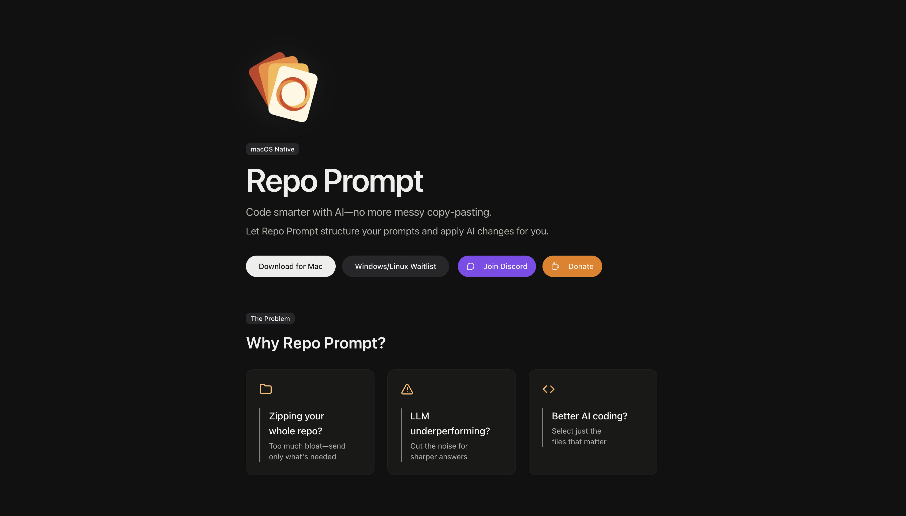

# Repo Prompt

<div align="center">
  
</div>

## Code Smarter with AI

Repo Prompt helps you select, format, and transfer code to AI models like Claude and ChatGPT without messy copy-pasting. Structure your AI prompts and apply code changes easily.

## Features

- **Smart File Selection**: Manually pick files with advanced filtering options
- **Optimized XML Output**: Provides structured file tree and meta-prompts
- **Codemap Extraction**: Automatically extracts API definitions and references
- **Token Usage Estimation**: Know your context size before sending
- **Full Context Control**: Unlike tools that use RAG when exceeding token limits, Repo Prompt maintains full context with ordering

## Workflow

### 1. Compose
Select files and folders for your prompt's context. Use saved prompts and a repository map to guide the AI's output.

### 2. Chat
Iterate on your files or learn about how they work with full control over the context.

### 3. Review
Review all AI-made changes, file by file, and approve changes, piecemeal or in bulk.

## Why Use Repo Prompt?

- **No More Bloated Context**: Stop zipping your whole repo - send only what's needed
- **Better AI Performance**: Cut noise for sharper answers from your AI assistant
- **Targeted Code Selection**: Select just the files that matter for your current task

## Getting Started

First, run the development server:

```bash
# preferred
bun dev

# not tested
npm run dev
# or
yarn dev
# or
pnpm dev
```

Open [http://localhost:3000](http://localhost:3000) with your browser to see the result.

You can start editing the page by modifying `app/page.tsx`. The page auto-updates as you edit the file.

## Privacy

Repo Prompt is designed with privacy as a core principle. We do not collect or store your code, and we minimize data collection to the bare essentials for analytics and service improvements.

## Learn More

To learn more about Next.js, take a look at the following resources:

- [Next.js Documentation](https://nextjs.org/docs) - learn about Next.js features and API.
- [Learn Next.js](https://nextjs.org/learn) - an interactive Next.js tutorial.

## Community

- [Join our Discord](https://discord.com/invite/NtbFDAJPGM)
- [Support on Ko-fi](https://ko-fi.com/repoprompt)

## Deploy

The easiest way to deploy your Next.js app is to use the [Vercel Platform](https://vercel.com/new?utm_medium=default-template&filter=next.js&utm_source=create-next-app&utm_campaign=create-next-app-readme) from the creators of Next.js.

Check out our [Next.js deployment documentation](https://nextjs.org/docs/app/building-your-application/deploying) for more details.
